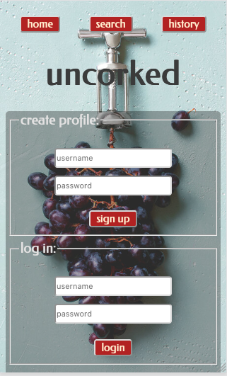

# Uncorked  

## *Open. Experience. Record. Revisit.*

    Uncorked is a way to record your favorite wine experiences. Open something  
    new, save the details, remember and revisit your favorites by searching  
    any of those details. Discover. Delight. Uncork it!

### [Check out the app here!](https://uncorked-client-dqm5m1mwx.vercel.app)  
&nbsp;&nbsp;&nbsp;Demo Credentials:  
&nbsp;&nbsp;&nbsp;&nbsp;&nbsp;unsername: User  
&nbsp;&nbsp;&nbsp;&nbsp;&nbsp;password: Tornado5!  
#### [Client Repository](https://github.com/schism578/uncorked-client.git)
#### [API Repository](https://github.com/schism578/uncorked-api.git)

### Technologies:  
&nbsp;&nbsp;&nbsp;**React**  
&nbsp;&nbsp;&nbsp;**CSS**  
&nbsp;&nbsp;&nbsp;**Jest**

### Screenshots:

